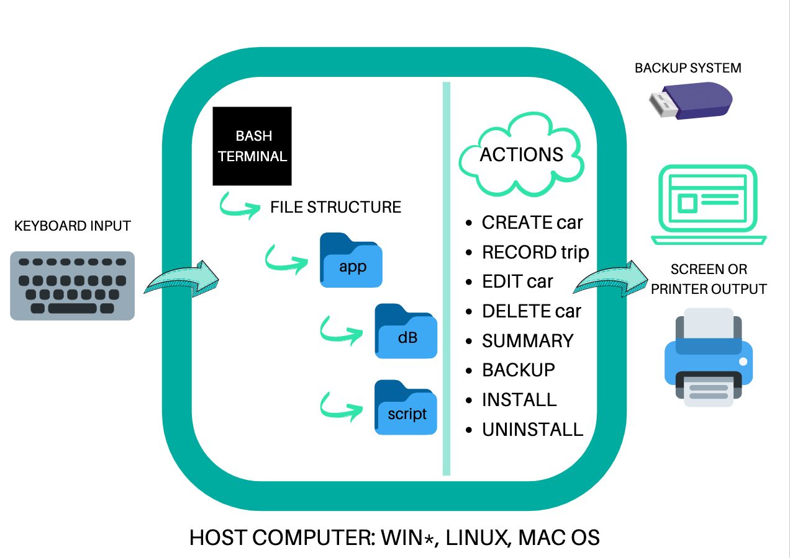
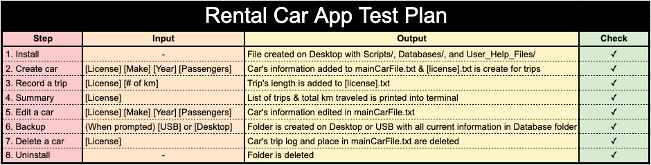
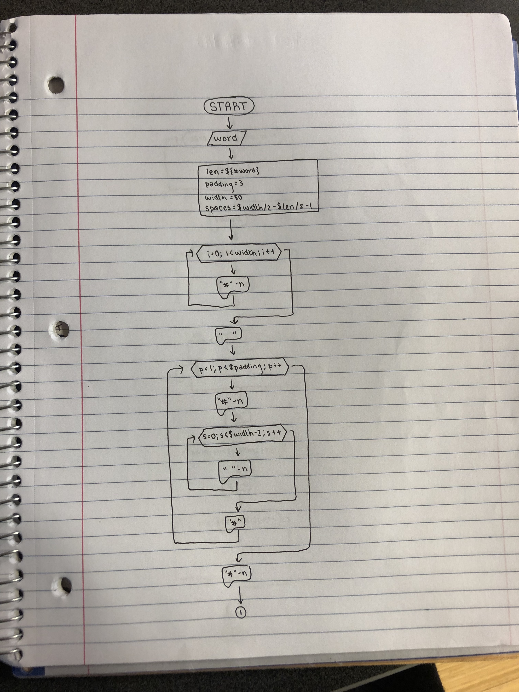
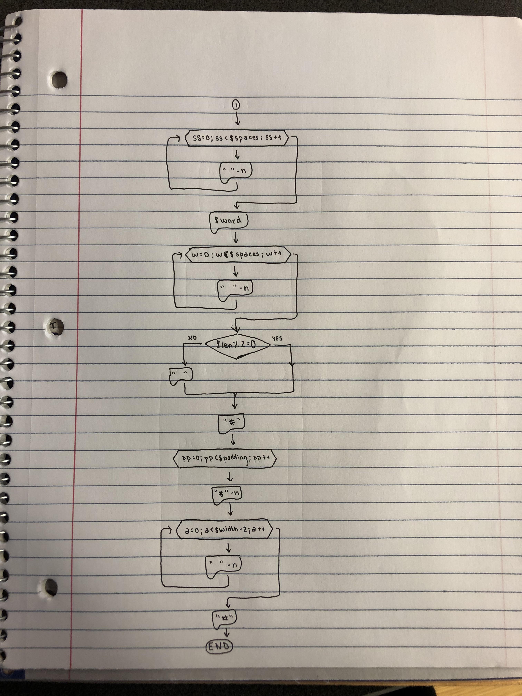
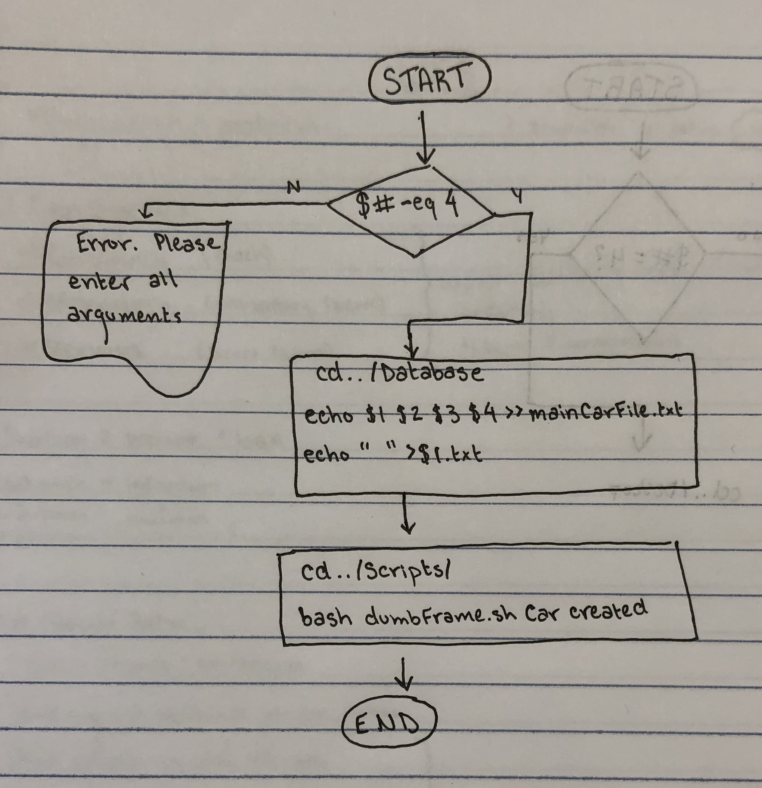
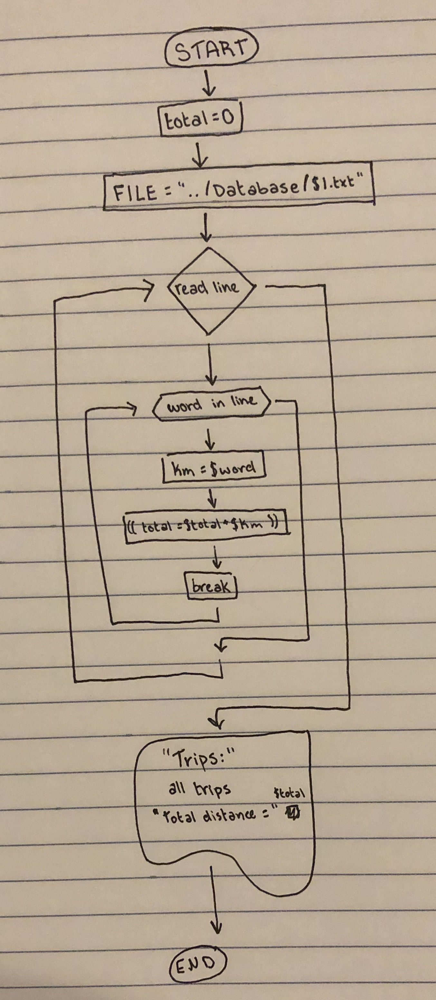

Car Rental Minimal App
===========================

A car rental management minimal app in Bash.

Contents
-----
  1. [Planning](#planning)
  1. [Design](#design)
  1. [Development](#development)
  1. [Evalution](#evaluation)

Planning
----------

### Definition of the problem
A car rental company is looking for a new system that can help them record data about their cars, specifically regarding the trips they have made.

Currently, this is done on paper. This is an incredibly inefficiant system, as it is difficult to organize and access. The pages must be sorted by-hand, and if one is lost or destroyed, the information is gone. the company is looking for a way to store their information on the computer and back it up regularily.

However, they do not know much about computers. They want to be able to create, delete, and edit basic information about each car. They also want to record trips and see a summary of their trips upon request.

I have volunteered to create this system for them, and make it as simple as possible while meeting their need of storing information efficiently and reliably.

### Proposed Solution
The Minimal Car Rental app program on bash is very feasible, with minimal organizational issues. The project centers around **technical feasibility**, using only bash and the terminal, making that aspect simple and not concerning. This also means that the **economic factor** of the program is very feasible, because the user does not need to spend any money on extra software or training. The project is **legal**, since all it does is record information inputted by the user. The **operational feasibility** of the project is relatively simple; each car both has its own .txt file and contributes to an aggregate .txt file, and the script prompts the user for specific inputs. The **schedule** of the project depends on the experience of the coder, however, it couldn’t take more than a week to develop the programs to input various information into the files. Ultimately, this system is very realistic and could easily be developed.

This solution also accurately meet's the uder's needs. The old system was on-paper, creating limitations of the security and organization of the data. This program fixes both problems. The user's information is all stored on the computer, and there is a program to backup the data internally or externally.


### Success Criteria
These are outcomes that can be measured
* A car can be created, deleted, and edited
* A trip can be recorded for a given car
* A summary (total distance travelled, average) of trips can be requested
* A basic working backup system is available
* The user can easily (name notation, documentation) understand the commands
* Simple installation & uninstallation (no additional software, one-step process)

Design
---------

### First sketch of system



**Fig 1** this diagram shows the main components of the minimal rental app. It includes inputs/outputs and main actions.


### Test plan

The following is the way in which we will test the program:



## Flow Charts

### Framing text (used in create.sh)
 


### Creating a car


### Summary of a car's trip


Development
--------

### Script for installation

The script below shows the complete creation of the folder structure for the application

*This segment has been edited since its original creation to include a more updated version of install.sh*

```.sh
#!/bin/bash
#This program creates the folder structure for the minimal rental car

#Start installation process
bash dumbFrame.sh Welcome
echo "Starting installation"
echo "Installing in desktop (default). Click ENTER."
read


#Navigate to Desktop
cd /Users/lydiaetherington/Desktop

#Create App Folder and Contents
mkdir RentalCarApp
cd RentalCarApp
mkdir Database
mkdir Scripts
mkdir User_Help_Files
cd Database/
echo " " > mainCarFile.txt

#copy all scripts into folder
cp /Users/lydiaetherington/Desktop/School/Comp_Sci_Stuff/progress-journal-lyds-jane/unit1/Scripts/* ~/Desktop/RentalCarApp/Scripts

#copy help files
cp /Users/lydiaetherington/Desktop/School/Comp_Sci_Stuff/progress-journal-lyds-jane/unit1/User_Help_Files/* ~/Desktop/RentalCarApp/User_Help_Files

#Navigate to folder so user can start using program
cd ~/Desktop/RentalCarApp/Scripts/

#Finish Installation
echo "Installation completed successfully"
```

This script meets the requirement of the client for a simple installation. However, it could be simplified so that the user does not need to excecute the program by typing ``bash install.sh``

### Problem Solving

**How to detect if a number is odd or even

```.sh
  if [ $len % 2 -eq 0 ]
```

**How to create uninstall program

```
cd /Users/lydiaetherington/Desktop
rm -r RentalCarApp/
```

### Developing Actions

**Create New Car

This process involves the inputs License, Make, Year, and Passengers being added to the main car file and its own file.
The following steps describe the algorithm

1. Get the inputs as arguments `$1 $2 $3 $4`
2. Ensure that the user has given all four arguments
```
if [ $# -ne 4 ]; then
  echo "Error. Please enter all information."
fi
```
3. Store new car inside mainCarFile.txt
`echo $1 $2 $3 $3 >> mainCarFile.txt`
4. Create new file for recording trips
`echo " " > $1.txt`


**Record New Trip

This process involves the inputs License and Distance being added to the car's file

1. Get the inputs as arguments `$1 $2`
2. Check that the car exists
```
if [ ! -f $1.txt ]; then
  echo "Car does not exist"
fi
```
3. Add new trip to car's file
```
echo $2 >> $1.txt
```

**Summarize Trips

For this program, we encountered three problems we needed to solve:

1. Reading a .txt file line by line
To solve this problem, we used a while loop:
```.sh
FILE="../Database/k94llp.txt"
while read line
do
  echo $line
done < $FILE
```

2. Splitting a line by spaces
In order to print each value of a line individually, we used a for loop:
```.sh
FILE="../Database/k94llp.txt"
while read line
do
  #Bash splits a line by spaces
  for word in $line
  do
    echo $word
    #Only print first word with break:
    break
  done
done < $FILE
```

3. Adding terms in a .txt file
Once all of the elements are organized in the file, adding them together was very simple:
```
total=0
FILE="../Database/k94llp.txt"
while read line
do
  #Bash splits a line by spaces
  for word in $line
  do
    km=$word
    (( total=$total + $km ))
    break
  done
done < $FILE
```

### Use of Programming Tools

**Bash commands

This application uses exclusively bash commands. This can be easily used in the Terminal, and is simple for the user without requiring any extra training or installation. Examples of bash commands can be seen in all snippets of code on this document.

**For loops

For loops were used frequently for this program. They helped shorten code and repeat long processes. An example of a for loop is shown below. In this scenario, the for loop is used to break up lines of text into individual numbers that can then be added together.


**If statement

This is a very common tool. It was used many times in the RentalCarApp, but most frequently to check the user's arguments. An example is shown below:


**User help files with man pages

We are using the man pages protocol to provide user information.

For further information on the man pages, see: https://www.cyberciti.biz/faq/linux-unix-creating-a-manpage/

Here is the code for our man page, create.6:

```
.TH man 6 "29 Oct 2019" "1.0" "create man page"
.SH NAME
create \- Creates a new car
.SH SYNOPSIS
bash create [license] [model] [colour] [passengers]
.SH DESCRIPTION
Create is a bash program that allows users to create a new car inside the Database and a new car file
.SH AUTHOR
Programmer Lydia Etherington
```

**Storing information with GitHub

The creation of this software utilized GitHub to save progress, and to provide a dialogue between teachers and students while learning the syntax. However, GitHub is not used in the actual application, as it is not something easily accessible to everyone.

### Consultation of External Sources

All of the code was created by Lydia Etherington, with the exception of the examples below:


Created by Alex Nygard and Khalid Ismail

Created by Alex Nygard and Khalid Ismail


Created by Dr. Ruben Pinzon

Created by Dr. Ruben Pinzon

Evaluation
-----------

### Testing create.sh

Test 1: A car can be created and stored in the database
For this purpose we will create the file testCreate.sh. This is called software testing.

First, we need to check that the file create.sh exists:
```
cd ../scripts/
if [ -f "create.sh" ]; then
        echo "File exists, test will start now."
else
        echo "Error. File create.sh does not exist. Test failed."
        exit
fi
```

Then, we run the program to create a car:
```
bash create.sh TXM901 Nissan red 9
```

Once the car has been created, we need to check two things:

#1: Was a .txt file created for this car?
```
cd ../Database/
if [ -f "TXM901.txt" ]; then
        echo "First stage successful. Proceeding with test"
else
        echo "Test failed."
        exit
fi

```

#2: Was this car added to mainCarFile.txt?
```
cd ../Database/
firstline=$( tail -n 1 mainCarFile.txt )
if [ "$firstline"  == "TXM901 Nissan red 9" ]; then
        echo "Test successful."
else
        echo "Test failed."
        exit
fi

```

Then, we need to delete the car created by the test.
```
cd ../Database/
rm TXM901.txt
echo " " > mainCarFile.txt
```

This is known as **dynamic, alpha, white-box** testing. Dynamic testing is when the program is excecuted through the test, as opposed to static testing, where the code is simply read through. In this test, create.sh is run and checked for errors, making this test dynamic. Alpha testing is when a program is tested internally by developpers, before being released to the client. Since we used this to test our own code, it was alpha testing. However, if the user used testCreate.sh to test the program, it would be beta testing. Finally, white-box testing (or structural testing) is when the test looks inside the program in order to check its functionability. This is different than black-box testing (or functional testing), where the structure is unknown, and software interfaces are used. Since this program looks inside mainCarFile.txt and Database/ for the new car, it is white-box testing.


## Final evaluation

Earlier, we established the success criteria as the following:
* A car can be created, deleted, and edited
* A trip can be recorded for a given car
* A summary (total distance travelled, average) of trips can be requested
* A basic working backup system is available
* The user can easily (name notation, documentation) understand the commands
* Simple installation & uninstallation (no additional software, one-step process)

Using this, in conjunction with the [test plan](#design), we can determine that this program is successful. All of the actions are possible: create, delete, edit, record, summary, and backup. These processes are all very simple, and give the user comprehensible error commands should they forget to input certain information. Furthermore, all variables are appropriately named, and the code features comments that make it easy to understand. Finally, the installation and uninstallation processes are quite simple. Once the program is run, the user does not need to do anything except confirm the action by clicking enter.

In the future, this program could be changed to be simpler and more effective. To make it simpler, first, program names could be changed to not include the .sh, as this is very easy for the user to forget. Furthermore, there could be more user help documentation provided, giving the user information on how to use each program, including adding arguments. To make it more effective, the installation process could be improved. The file pathways and names are specific to my laptop, and the program copies all the files from a local folder. In order for external sources to be able to use this program, these would have to be changed to accomodate anyone's computer. Furthermore, the program could include more information, such as trips' dates. Ultimately, this program could include more elements, but it is a succesful mininmum viable product.
